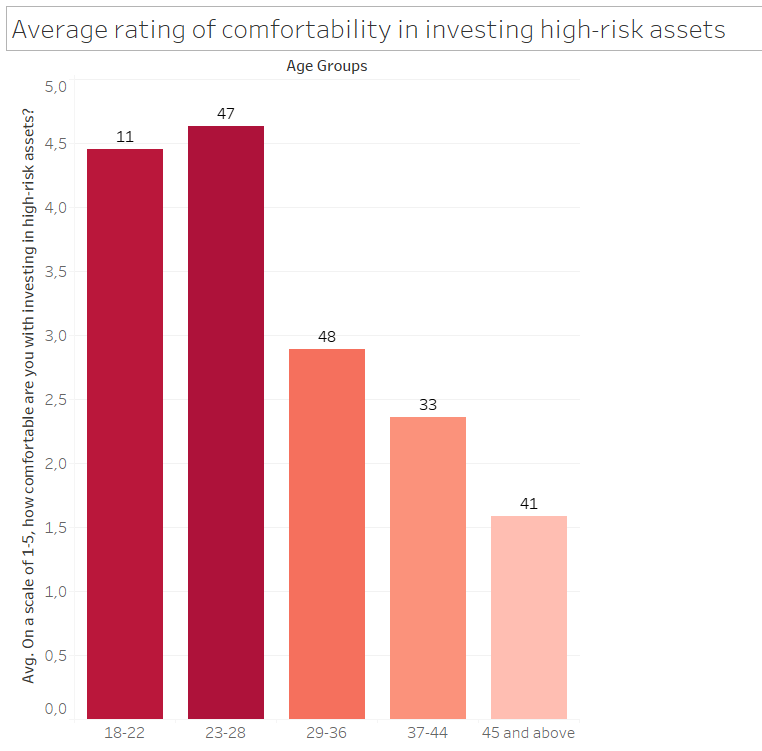
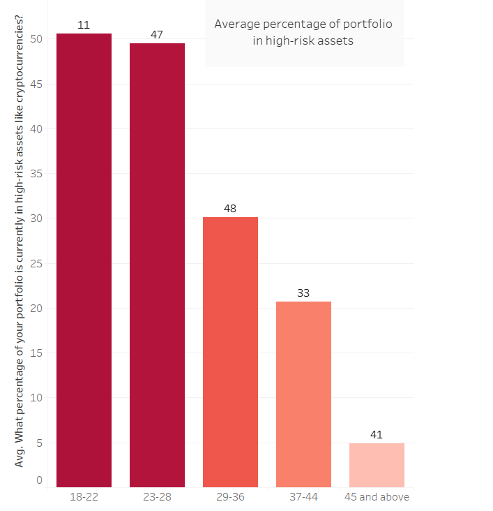
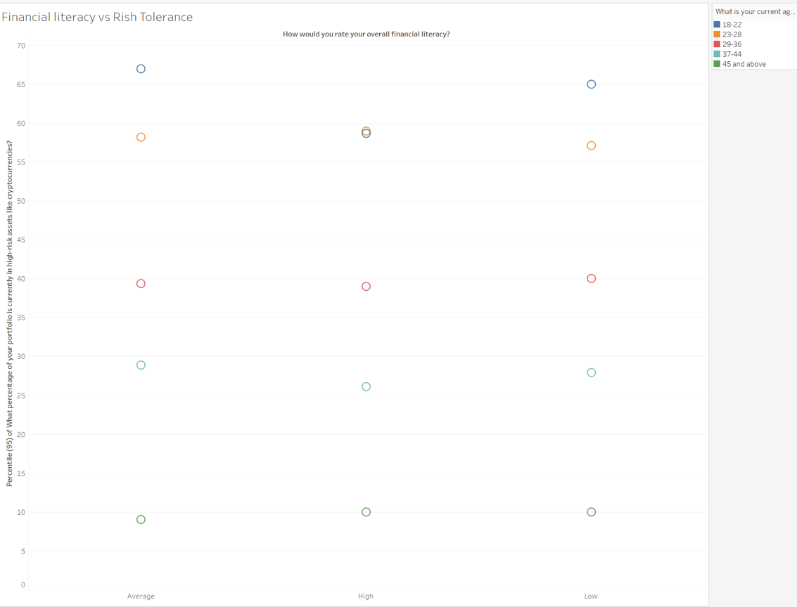

# Research Project Report

## Introduction

Understanding investor behavior is crucial for financial advisors, businesses, and policymakers aiming to tailor strategies that align with individual risk profiles. This study examines the influence of age on risk tolerance and investment preferences, with a particular focus on younger investors' inclination toward high-risk assets like cryptocurrencies. The primary research hypothesis posits that younger investors exhibit higher risk tolerance and are more likely to allocate a significant portion of their portfolios to high-risk assets. Additionally, the study explores the counterhypothesis that age does not significantly affect risk tolerance or asset allocation. 

The significance of this research lies in its potential to inform investment advisory practices and product development. Businesses in the financial services sector can better segment and target clients by understanding demographic variations in risk preferences. As cryptocurrencies and other high-risk assets gain prominence, insights into investor behavior can drive innovation in portfolio management tools and educational resources, enabling better alignment with client objectives and market trends. 

Moreover, the research addresses critical business challenges, including enhancing client satisfaction, reducing churn in investment advisory services, and optimizing product offerings. By analyzing variables such as financial literacy, diversification strategies, and investment objectives, the study provides actionable insights into the evolving landscape of investor behavior across age groups. 

## Methodology

This study employs a quantitative survey design to gather data on investors' demographic characteristics, financial literacy, risk tolerance, and portfolio composition. The survey instrument includes a structured questionnaire with a combination of multiple-choice, Likert-scale, and open-ended questions to capture a comprehensive dataset.

### Survey Design

The questionnaire was developed to address the following key areas:
1.	Demographics: Age, gender, education, income, marital status, and dependents.
2.	Financial Behavior: Financial literacy, risk tolerance, investment strategy, and portfolio composition.
3.	Risk Preferences: Comfort with high-risk investments, reactions to hypothetical scenarios, and primary investment objectives.
To ensure clarity and relevance, the questionnaire underwent pilot testing with a small sample of 10 participants, leading to refinements in phrasing and structure.

### Sampling Method

The research employed a non-probability convenience sampling technique, targeting individuals with diverse backgrounds through online distribution. The sample included respondents from various age groups (18–22, 23–28, 29–36, 37–44, and 45+), income levels, and employment statuses to capture a broad spectrum of investor profiles. Efforts were made to achieve gender balance and include respondents from both high- and low-risk investment backgrounds.

### Data Collection

Data was collected over two weeks via an online survey platform i.e. Google Forms, ensuring accessibility and ease of participation. Respondents were recruited through social media platforms, financial forums, and email invitations to relevant professional networks. Anonymity and confidentiality were maintained throughout the process to encourage honest responses.

### Analysis Plan

The collected data was cleaned and analyzed using statistical tools. Descriptive statistics were used to summarize demographic and behavioral variables, while inferential analyses, including correlation and regression, were conducted to test the hypothesis. Cross-tabulations were used to explore relationships between age, risk tolerance, and portfolio allocation. The analysis also included subgroup comparisons based on financial literacy levels and diversification strategies.

## Results

### Investment in High-Risk Assets  

 

One of the aspects we researched was the relationship between age and risky investments. Our results strongly supported the hypothesis that younger generations are more comfortable with high-risk investments and are more likely to populate their portfolios with assets such as cryptocurrencies, NFTs, and other speculative instruments. In Figure 1, we illustrate the average comfort level of each age group with investing in high-risk assets, measured on a scale of 1-5. Responses showed that the youngest age groups (18-22 and 23-28) exhibited the highest comfort levels, with an average rating of 4.5. We attribute this to a combination of lower financial literacy and higher internet literacy. The accessibility of online resources and the influence of social media likely reduce the perceived intimidation associated with the volatility of such assets. As expected, the comfort level progressively decreases with age. 

 

Figure 2 presents the average percentage of high-risk assets within each age group’s portfolio. The largest proportion (approximately 51%) is associated with the youngest age group (18-22), followed closely by the 23-28 group at 49%. This proportion decreases to 30%, 21%, and finally 5% for the oldest age group (45+). This distribution demonstrates a stark contrast: the youngest groups tend to "put their eggs in one basket," while older groups deliberately avoid high-risk assets. Several factors may explain this pattern. Younger adults, with comparatively less disposable income, are drawn to higher returns despite the associated risks. Meanwhile, older generations, benefiting from stable incomes and accumulated assets, prioritize diversified portfolios with moderate risks to achieve long-term financial stability. 

### Factors Influencing Investment Decisions 

Investment decisions are often shaped by personal goals, such as wealth accumulation, retirement planning, or short-term profit. Market trends and access to information also play a significant role in shaping investor behavior. Additionally, psychological factors like risk perception and confidence levels can greatly impact the willingness to invest in high-risk assets. Understanding these factors is crucial for both investors and financial advisors in optimizing portfolio strategies.

Using statistical methods such as correlation analysis, variance calculations, and ANOVA testing, we explored how financial literacy, age, and high-risk portfolio allocation influence investor behavior .

https://colab.research.google.com/drive/15RLkRrXXuIrU0DRFb5jENsAj49HY0xnO?usp=sharing

#### Results and Interpretation

1.	Correlation Analysis:
-	Correlation between Financial Literacy and High-Risk Portfolio Allocation:
i.	Pearson r=0.018: Very weak positive correlation, indicating almost no relationship between financial literacy and portfolio allocation to high-risk assets.
-	Correlation between Age Group and High-Risk Portfolio Allocation:
i.	Pearson r=−0.955: Strong negative correlation, suggesting that younger investors allocate a significantly higher proportion to high-risk assets compared to older groups.
-	Correlation between Age Group and Financial Literacy:
i.	Pearson r=0.003: No meaningful relationship between age and financial literacy.

2.	Variance in High-Risk Portfolio Allocation by Financial Literacy:
-	Low: 437.15%
-	Average: 398.02%
-	High: 364.37%
-	Observations: Higher variance in the "Low" literacy group implies more inconsistent portfolio behavior.

3.	ANOVA Results:
-	p-value = 0.926: No statistically significant difference in high-risk portfolio allocation means across financial literacy groups

We can conclude by saying 
- Age has a strong negative correlation with portfolio allocation to high-risk assets, supporting the hypothesis that younger investors show a higher risk tolerance.
- Financial literacy shows no significant correlation with portfolio allocation, suggesting that experience and education in finance might not directly influence risk-taking behaviors.
- There is no evidence of a significant difference in risk-taking based on financial literacy levels (ANOVA p-value > 0.05 ).

The scatter plot illustrates the relationship between financial literacy levels (Low, Average, High) and the percentage of portfolios allocated to high-risk assets (e.g., cryptocurrencies) across different age groups. Younger investors (18–28) consistently allocate higher percentages to high-risk assets, regardless of financial literacy. Conversely, older age groups (37 and above) show lower allocations, even with high financial literacy.

This suggests that age plays a stronger role in shaping risk tolerance than financial literacy alone, highlighting the influence of life stage and external factors over formal financial knowledge.

### Portfolio Diversification
Our findings strongly support that investors diversify their portfolios across a broader range of asset classes as they age. 

Figure 1 (Portfolio Diversification by Age Group) highlights a clear trend: younger investors average only 1.2 asset classes in their portfolios, emphasizing concentrated investments, often in high-risk, high-reward assets. In contrast, older investors, particularly those aged 45 and above, average 2.8 asset classes, showcasing a deliberate approach to risk mitigation and stability through diversification.

For younger age groups, limited diversification appears influenced by two key factors:

- **Constrained Disposable Income:** Drives them toward investments promising higher returns, despite the inherent risks.
- **Internet and Social Media Influence:** Encourages preference for speculative assets like cryptocurrencies frequently marketed as lucrative opportunities.

In contrast, older investors prioritize reducing exposure to risk. 

As depicted in Figure 2 (Average Crypto Allocation), the allocation to high-risk assets like cryptocurrencies declines sharply with age. The youngest group allocates over 50% of their portfolios to these assets, whereas this drops to under 5% for the 45+ age group. This shift underscores a transition from speculative strategies to diversified portfolios aligned with long-term financial stability, demonstrating distinct generational approaches to investment.

 
## Discussion

Given the following null hypothesis: 
H₀: There is no significant relationship between age and risk tolerance, nor between age and the likelihood of allocating funds to high-risk assets such as cryptocurrencies. 

One of the aims of this research was to compare our findings with pre-existing literature. However, it soon became apparent that past studies on the subject, particularly on the behavioral aspects of investors, labeled as ‘investor’ those entities that were either financial institutions or high-net-worth individuals, - the traditional market makers and movers. Our survey, on the other hand, targeted exclusively the so-called ‘retail investors’, individuals who may lack market influence on their own, but are a significant player as an aggregate. 

Some biases included the number respondents predominantly falling between the range of ages 28-36, very few being younger than 22. Additionally, there may have also been some cultural misunderstandings regarding the questions related to income in HUF. Other background data, mainly related to marital status, education, etc., was evenly distributed amongst the respondents. This made data analysis fairer. 

The findings strongly supported our initial hypotheses: younger individuals were more likely to adopt riskier investment strategies and generally showed lower levels of financial literacy. Unfortunately, data on actual financial experience could not be used as a benchmark, as most responses pointed to one to three years of investment experience, the latter being a potential substitute for financial literacy. 

Despite younger respondents generally having a perception of themselves as ‘risk takers’, many questions that presented hypothetical scenarios regarding guaranteed low-term-losses (or gains) vs potential long-term-losses (or gains), were often met by younger investors with the most short-sighted response. This may show that younger people, despite initially opting for more volatile assets, may eventually quit their positions at the first hint of financial loss. This stands in clear juxtaposition to older investors, who, being more likely to pursue conservative strategies, tend to nonetheless opt for long term investments.  

## Conclusion

This study showcased key insights into age-based investment behaviors, providing actionable opportunities for financial service providers to refine their offerings. Younger investors, characterized by a high tolerance for risk and a strong preference for speculative assets like cryptocurrencies, represent a growing but underserved segment. Conversely, older investors, who prioritize diversification and risk mitigation, align more closely with traditional financial products.

To capture the younger market, financial service providers should develop targeted products that balance high-growth opportunities with stability. This could include hybrid portfolios combining speculative and conventional assets, supported by interactive platforms that resonate with their digital fluency. Additionally, financial literacy tools embedded within these platforms can help younger investors better understand risk management and portfolio diversification.

For older clients, providers should focus on personalized advisory services that emphasize stability and risk management. Automated portfolio diversification tools, income-focused investment strategies, and conservative high-yield options can address their long-term financial goals while maintaining engagement.

Aligning financial services with the distinct needs of these generational segments not only improves customer satisfaction but also drives retention and profitability. By integrating these strategies, financial service providers can position themselves as leaders in delivering tailored, effective solutions that adapt to evolving market demands. 

## Reflection

Our team effectively implemented Agile principles through structured weekly Sunday meetings and ongoing communication in a dedicated group chat. The meetings provided a platform to review progress, discuss challenges, and ensure that everyone remained aligned and engaged. The group chat served as a space for quick clarifications, sharing insights, and resolving questions, which kept the workflow efficient. 

Workload distribution was equitable, with all members contributing equally to the project. Open discussions during meetings encouraged critical thinking and allowed different perspectives to shape our decisions, ultimately improving the quality of our work. 

Despite these strengths, we encountered challenges, such as occasional scheduling conflicts. However, the team’s adaptability and proactive communication helped us navigate these obstacles effectively. For example, when a team member faced time constraints, others stepped in to provide support, ensuring that deadlines we set were met without compromising quality. 

By embracing Agile principles, we created a collaborative, flexible environment that not only overcame challenges but also enhanced the overall quality and efficiency of our work.
